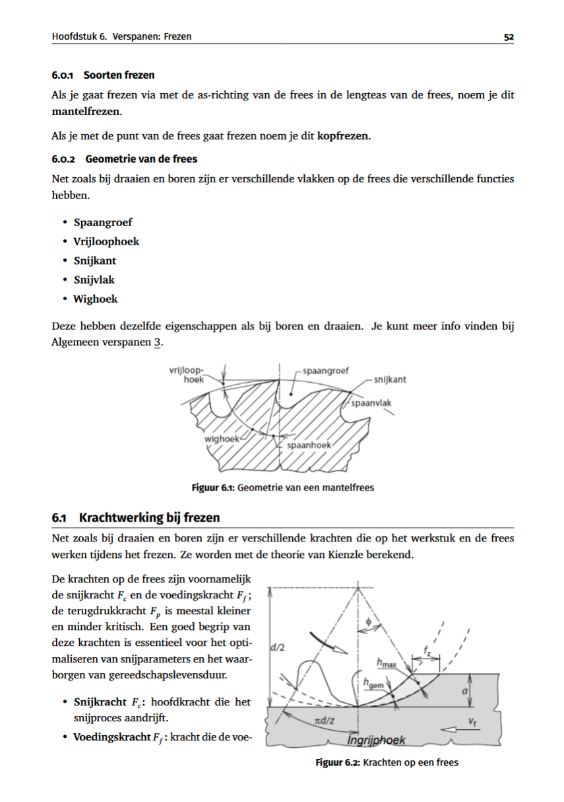

# School Samenvattingen

[](LICENSE)


[](https://discord.gg/gsDzr5qhPe)


Welkom bij de samenvattingen voor Industriële Ingenieurswetenschappen aan de KU Leuven.

Deze repository zijn mijn notities en samenvattingen die ik gemaakt heb door het jaar heen. Ik heb ze open-source gemaakt zodat medestudenten ze kunnen gebruiken maar ook zelf kunnen verbeteren als ze willen.

---

## 📚 Vakkenoverzicht

<!-- VAKKENOVERZICHT_START -->
<details>
<summary><strong>1ste jaar</strong></summary>

- Nog geen vakken toegevoegd
  </details>

<details>
<summary><strong>2de jaar</strong></summary>

- Distributie van elektrische systemen
- Ingenieur en economie oefeningen
- math-systems
- Object gericht-programmeren
- Ontwerp van een industriële sturing
- Productietechnologie
- Statistiek en databeheer
- Systeem en regeltechniek
- Thermal fluid sciences
- Toegepaste mechanica & dynamica
- Warmte en stromingen
- Wisselstroom
  </details>

<details>
<summary><strong>3de jaar</strong></summary>

- Eindige elementen gebaseerd ontwerp
- Information Management
- Manufacturing Technologies 2
</details>
  <!-- VAKKENOVERZICHT_END -->

---

## Contributors

<a href="https://github.com/KUL-Industriele-ingenieurs/Samenvattingen-Ku-leuven-Industriele-ingenieurs/graphs/contributors">
  
</a>

## Kies je tool: LaTeX of Typst

We ondersteunen twee systemen. Kies er één en volg de handleiding:

<table>
<tr>
<td width="50%" align="center">

### LaTeX

Dit ga je toch moeten leren (masterthesis) dus je kunt hier zeker mee beginnen.

- Installatie: MiKTeX + Perl (~2 GB)
- Compileren duurt een paar seconden
- Enorm veel packages beschikbaar
- Meest gebruikt in de academische wereld

**[Ik kies LaTeX → LATEX.md](LATEX.md)**

</td>
<td width="50%" align="center">

### Typst

Het moderne alternatief. Sneller, simpeler, en makkelijker te leren.

- Installatie: één commando (~50 MB)
- Live preview (direct resultaat)
- Leesbaardere code
- Nieuwer, maar groeiend ecosysteem

**[Ik kies Typst → TYPST.md](TYPST.md)**

</td>
</tr>
</table>

Ik heb heel de vs-code omgeving al klaargezet voor jou zodat alle extensies en instellingen je helpen om direct aan de slag te kunnen.

## Stap 1: Software installeren

**Vs-code**: IDE om notities te schrijven en te compileren
**Git**: Versiebeheer om samen te werken.

**Windows** (PowerShell):

```powershell
winget install --id Microsoft.VisualStudioCode --id Git.Git
```

**macOS** (Terminal):

```bash
brew install --cask visual-studio-code && brew install git
```

**Linux** (Ubuntu/Debian):

```bash
sudo apt install code git
```

Daarna installeer je **LaTeX** of **Typst** (of beide). Volg de stappen in:

- **[LATEX.md](LATEX.md)** — LaTeX installeren en gebruiken
- **[TYPST.md](TYPST.md)** — Typst installeren en gebruiken

> **Herstart je computer** nadat alles is geïnstalleerd.

---

Een korte uitleg van alle termen van git. Skip als je al bekent bent met git.

## Git-termen uitgelegd

Een kort overzicht van de belangrijkste Git-termen voor als je nog niet bekend bent met GitHub:

| Term                  | Wat het betekent                                                                              |
| --------------------- | --------------------------------------------------------------------------------------------- |
| **Repository (Repo)** | De map op het internet waar alle bestanden van dit project staan.                             |
| **Forken**            | Een kopie van het project maken naar je eigen GitHub-account, zodat je een eigen versie hebt. |
| **Clonen**            | De bestanden van GitHub naar je eigen computer kopiëren zodat je er lokaal aan kunt werken.   |
| **Branch**            | Een zijtak waar je veilig in kunt werken zonder het hoofdproject ('main') aan te passen.      |
| **Commit**            | Je wijzigingen opslaan met een korte beschrijving van wat je hebt gedaan.                     |
| **Push**              | Je lokaal opgeslagen wijzigingen terugsturen naar GitHub.                                     |
| **Pull Request (PR)** | Een verzoek indienen om jouw aanpassingen toe te voegen aan het hoofdproject.                 |

---

## Stap 2: Project opzetten

### 2.1 Maak een Fork (Je eigen kopie)

1. Ga naar de [originele pagina op GitHub](https://github.com/KUL-Industriele-ingenieurs/Samenvattingen-Ku-leuven-Industriele-ingenieurs).
2. Klik rechtsboven op de knop **Fork**.
3. Klik op **Create Fork**. Je hebt nu een eigen kopie op jouw GitHub-account.

### 2.2 Openen in VS Code (Clonen)

1. Open **VS Code**.
2. Klik linksboven op het icoontje met de drie streepjes (Menu) -> **File** -> **New Window**.
3. Klik op de knop **Clone Repository** op het startscherm (of via het 'Source Control' icoontje links).
4. Kies **Clone from GitHub**. Log in als daarom gevraagd wordt.
5. Zoek in de lijst naar `Samenvattingen-Ku-leuven-Industriele-ingenieurs` (jouw fork) en klik erop.
6. Kies een map op je computer waar je het project wilt opslaan.
7. Klik op **Open** als VS Code vraagt of je de gekloonde repository wilt openen.

### 2.3 Extensies

VS Code zal rechtsonder vragen om de "Recommended Extensions" te installeren. Klik op **Install**.

## Stap 3: Werken aan een samenvatting

### Voorbeeld van een samenvatting

Hier zie je het resultaat. Dit is hoe de theorie (met wiskunde formules en kaders) er uiteindelijk uit komt te zien in je PDF bestand:

<p align="center">
  
</p>

### 1. Maak een nieuwe Branch

Werk bij voorkeur niet direct in de 'main' branch, maar maak een nieuwe branch aan:

1. Klik linksonder in de blauwe balk op **main**.
2. Kies **Create new branch...**.
3. Typ een logische naam (bijv. `wisselstroom-hoofdstuk-1`) en druk op **Enter**.

### 2. Bewerken

- Open een `.tex` of `.typ` bestand.
- Breng je wijzigingen aan.
- **LaTeX PDF maken:** `Ctrl + Alt + B`, bekijken: `Ctrl + Alt + V`
- **Typst preview:** Klik op het oogje rechtsboven

## Stap 4: Je werk delen

### 1. Opslaan (Commit)

1. Klik links op het **Source Control** icoontje (vertakking).
2. Klik op de **+** naast de bestanden die je hebt gewijzigd.
3. Typ een korte beschrijving (bijv. "Uitleg over transformatoren toegevoegd").
4. Klik op **Commit**.

### 2. Versturen naar GitHub (Push)

1. Klik op **Publish Branch** (of op het pijltje linksonder in de blauwe balk).

### 3. Pull Request maken

1. Ga naar je fork op de GitHub-website.
2. Klik op de balk **Compare & pull request**.
3. Controleer of de pijlen naar `KUL-Industriele-ingenieurs/...` wijzen.
4. Klik op **Create Pull Request**.
5. Een van de beheerders zal je aanvraag nakijken en toevoegen.

## Vaker bijdragen?

Je kunt write-acces krijgen zodat je geen fork meer hoeft te maken. Als je vaak meer wilt werken aan de samenvattingen stuur dan een bericht naar @eggmansmile op de server [Industria Discord](https://discord.gg/gsDzr5qhPe).

## Hulp nodig?

- **[LATEX.md](LATEX.md)** — LaTeX installatie en handleiding
- **[TYPST.md](TYPST.md)** — Typst installatie en handleiding
- **[Debugging-van-building.md](Debugging-van-building.md)** — PDF bouwfouten oplossen
- **[Industria Discord](https://discord.gg/gsDzr5qhPe)** — Stel je vraag aan @eggmansmile

## Handige links en video's

- **[Git & GitHub in VS Code (Nederlands)](https://www.youtube.com/watch?v=hwP7WQkmECE)** – Samenwerken zonder terminal
- **[LaTeX voor Beginners](https://www.youtube.com/watch?v=UK8SMrS0G4Y)** – De basis van LaTeX
- **[Typst voor Beginners](https://www.youtube.com/watch?v=NTGkb4FCLhM)** – De basis van Typst

---

Bedankt voor je bijdrage.
